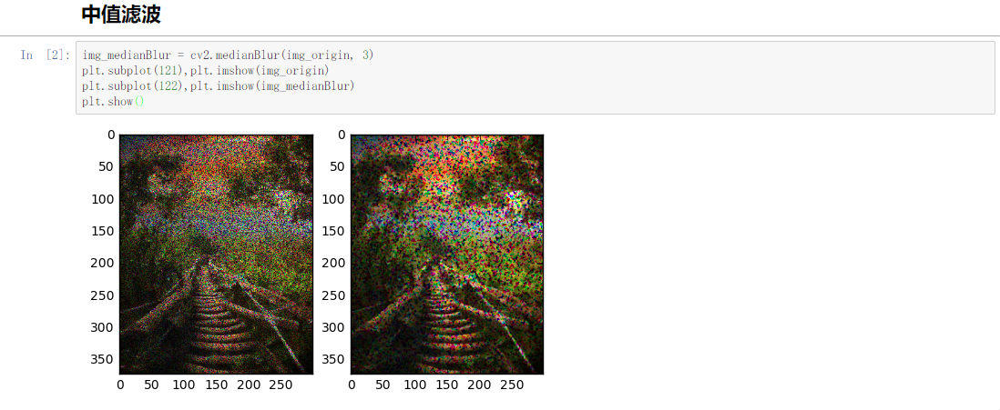
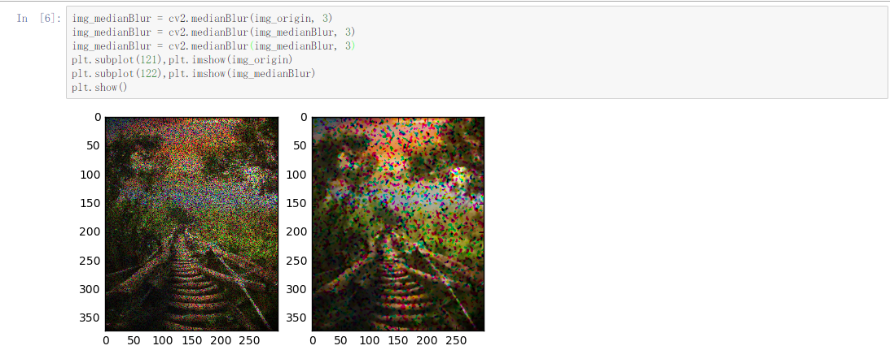
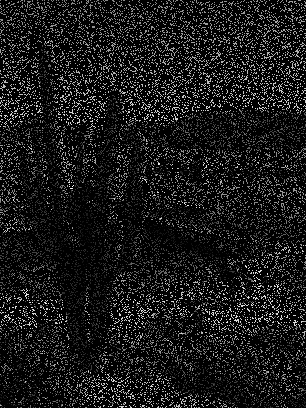
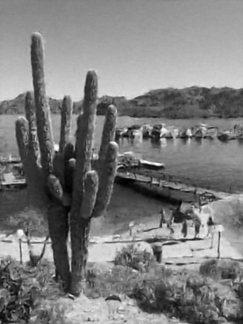
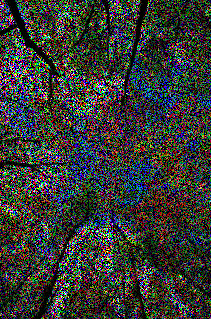
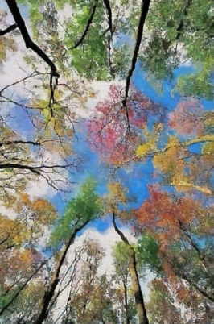

# Image-Denoising

## 问题

给定污染方式已知的图像，尝试恢复他们的原始图像。

## 具体污染方式

1. 受损图像由原始图像添加不同的噪声遮罩得到的，，为逐元素相乘。
2. 噪声遮罩仅包含{0, 1}值，分别对应原图的每行用0.8/0.4/0.6的噪声比率产生，即噪声遮罩的每个通道每行80%/40%/60%的像素值为0，其他为1。

## 恢复

### 基于传统滤波的考虑

#### 概述

实际上，根据噪声的产生方式，图片噪声实际上是一种比较特殊的椒盐噪声(随机改变一些像素值，使得一些像素点变黑，一些像素点变白)。于是，我们使用一些传统的滤波方式去试图去除噪声。

这部分工作主要借助于opencv这个图像处理库来实现，它提供了绝大部分滤波函数的封装。

#### 中值滤波



椒盐噪声实际上经常用中值滤波这种比较简单的方式去除，我们使用中值滤波去试图还原，发现有一定的去除效果，但是仍会残留许多的噪点。



我们试图增加中值滤波的迭代次数，发现此时的噪声趋于颗粒化。因为噪点的半径越来越大， 如果我们想要试图去除，就需要更大的中值半径，但这样，牺牲图像的细节品质也会越大。所以，中值滤波是一次失败的尝试。

#### 其他滤波方式

接下来我们尝试了，均值滤波，高斯滤波这些传统的线性滤波操作，以及除去中值滤波之外的其他非线性滤波操作，包括双边滤波，非局部均值滤波(NLMeans)，以及在去噪方面效果显著的BM3D算法等。效果都不尽人意。

[滤波处理代码](./filter/filter.ipynb)

#### 逆谐波均值滤波

当然我们也发现了一个比较好的滤波方法，逆谐波均值滤波，即IHMeans。

实际上这个方法的核心是在于对于每一个局部空间应用一下IHMeans算子: 。

我们对于基本的IHMeans给出来了实现，基本的IHMeans已经完成了对于噪点的去除，我们在这个基础上做了一些改进。

因为原图中那些未被删除的点是可信的点，我们可以充分利用这些点的确定性。在每次滤波完成之后恢复这些点的数据，继续下一次迭代。这种改进的迭代方法会被基本的IHMeans效果来的更好一些。但是不幸的是，这个类IHMeans方法很快就会达到收敛，没有更大的改善空间。

我们默认的迭代次数是3次。3次之内一般图片都可以达到收敛，并且都能得到一个比较好的效果。

[IHMeans代码](./filter/IHMeans.py)

```bash
$ python IHMeans.py --input A
```

#### 滤波结果

 

 

 

#### 总结分析

三幅图都实现了基本的去噪，但是很明显的，有这样几个缺点。

1. 由于使用了滤波的方法，不可避免的克服滤波的天生缺陷，无论是局部的还是非局部的，滤波的数据来源来自可信的其他数据，细节的损失就比较明显了，图片整体平滑化了，显得有些失真。
2. 因为迭代很快达到收敛，所以它的方法上限是固定的，可以看到图片C的恢复结果中仍然有颗粒，并且这个颗粒用这种方法已经无法去除，可以考虑和其他滤波方法来结合得到更好的效果。
3. 没有应用的80%/40%/60%这几个原本应该很敏感的mask参数。

### 基于CNN的图片去噪

这部分参照于论文[Beyond a Gaussian Denoiser: Residual Learning of Deep CNN for Image Denoising](http://www4.comp.polyu.edu.hk/~cslzhang/paper/DnCNN.pdf)。

数据集来自[CIFAR-10数据集](http://www.cs.toronto.edu/~kriz/cifar.html )。

#### 数据预处理

1. 对于三通道，我们直接读取CIFAR数据集中的图片内容，通过numpy转化成对应的图像矩阵即可。
2. 对于单通道，即黑白图像，我们也先通过读取CIFAR的数据集的内容，然后通过转化公式，将RGB模式转化为灰度图模式。具体的转化公式是 `Y = 0.299 R + 0.587 G + 0.114 B` 。

这样我们就充分利用了CIFAR-10数据集，得到了三通道和单通道的两类不同的实际数据集。

#### 数据遮罩

因为已经给定了图像污染的规则，那我们通过数据集得到的数据是clean images，是我们的目标函数。通过施加给定的噪声遮罩，我们可以得到noised images，作为训练的输入参数X。

#### 损失函数

设原图为Y\_，施加遮罩后的图像为X，通过CNN输出的图像为Y，损失函数即为Y和Y\_的图像差。

图像差很好计算，就是两个图像数据矩阵差的范式。

#### 模型结构

  

[模型代码](./cnn/model.py)

具体地，三个不同percent的图像恢复都采用10个卷积层的结构。激活函数采用relu。

#### 模型训练

```bash
$ python main.py --phase train --percent 0.4 --channel 3
```

其他参数像learning rate, batch size等都给了默认值。

GTX1080下训练大约在10min左右。训练结果保存在相应的checkpoint文件夹下。

#### 模型测试

```bash
$ python main.py --phase test --percent 0.4 --channel 3 --input B
```

#### 测试结果

 

 

 


